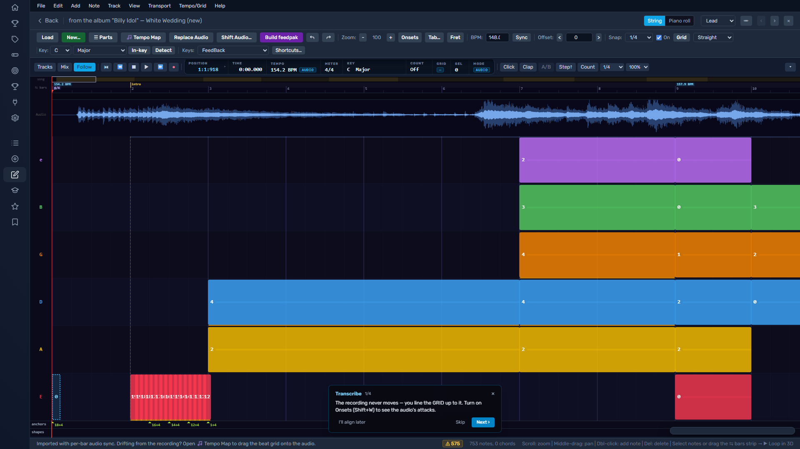
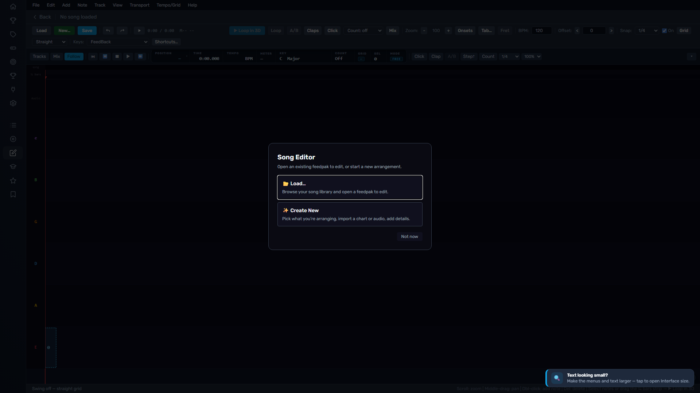
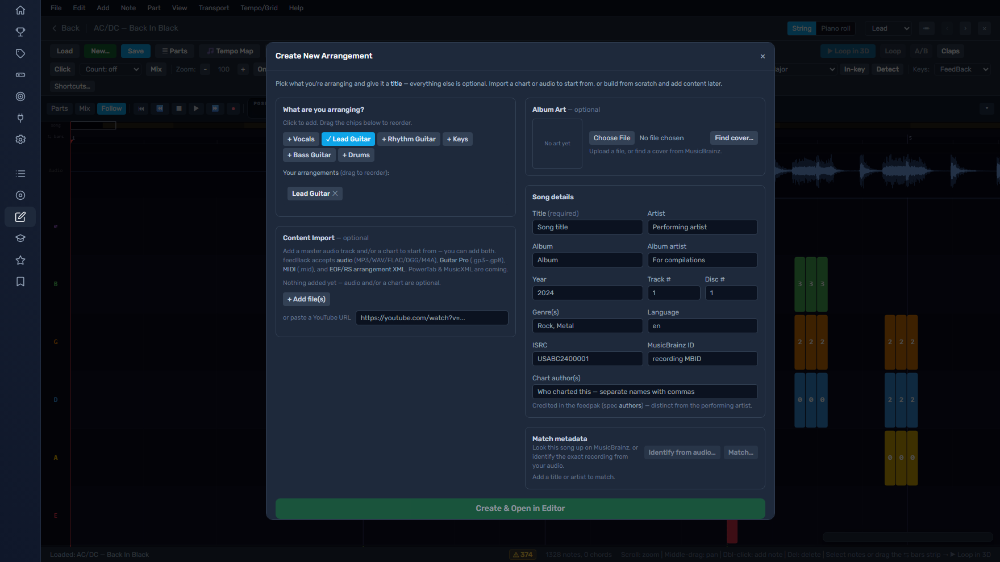
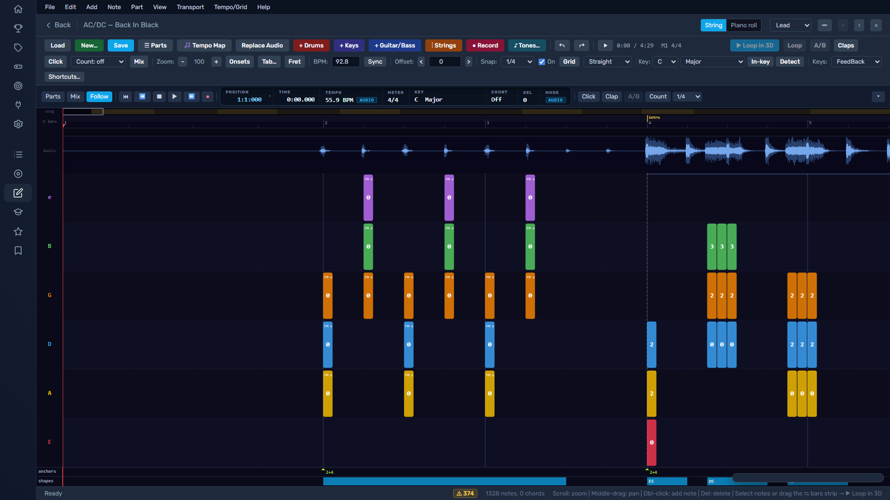
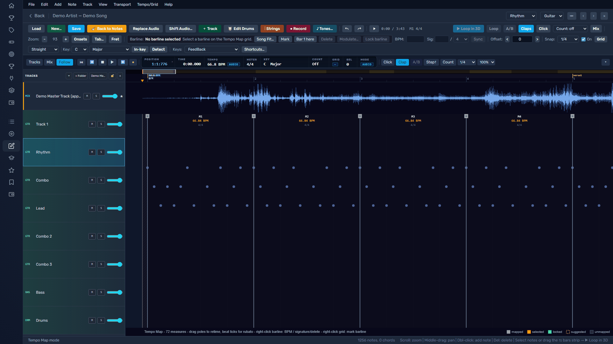
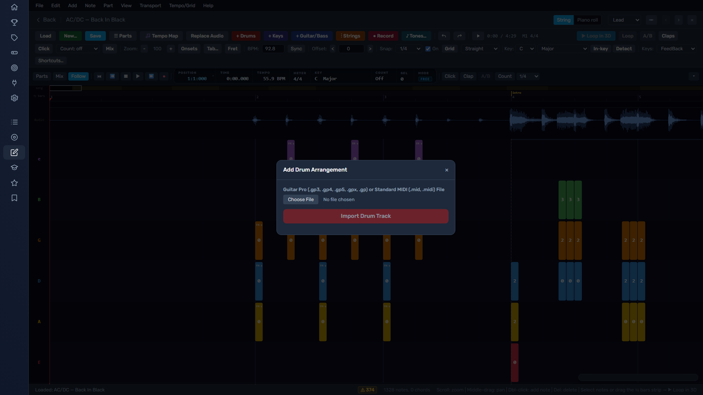

# Song Editor — User Guide

The **Song Editor** turns a recording into a playable feedBack chart. You line a
grid up to the music, place the notes, mark the tempo and sections, and build a
`.feedpak` the rest of the app can practice against.

This guide is the same content you get in-app from **Help ▸ User Guide**. It
covers the FeedBack shortcut profile (the default). Three other profiles remap
some keys to match muscle memory you may already have: **Logical**
(Logic-style — K clicks the metronome, Q quantizes, `,`/`.` step by beat, C
loops the selection), **Cableton** (Ableton-style — Ctrl+U quantizes, Ctrl+1/2
narrow/widen the grid, Ctrl+4 toggles snap, Ctrl+L loops), and **Legacy
(EOF)**. Anything a profile doesn't remap keeps its FeedBack key. Switch
profiles in **Help ▸ Shortcut profile** or the shortcut panel (`?`).

**The whole journey, at a glance** — a feedpak goes from nothing to playable in
six steps, and this guide follows them in order:

1. **Start** (§1) — create a project from a recording, an existing chart, or both.
2. **Line up the grid** (§6) — the tempo map fits bars and beats to the recording.
3. **Chart the notes** (§4) — place, edit, and mark up every note and technique.
4. **Build out the tracks** (§5, §7) — more parts, keys with hands, drums, studio stems.
5. **Hear it** (§3) — guide claps, the metronome, loops, and the mixer console.
6. **Save and build** (§9) — `Ctrl+S` while you work; **Build** writes the `.feedpak`.

---

## 1. Start a project

Opening the editor with nothing loaded lands you at the front door:

**Load…** opens a feedpak from your library to edit. **Create New** starts a
project — and it takes almost anything as a starting point:

- **A recording** — drop in an audio file (**MP3, WAV, FLAC, OGG, M4A, OPUS,
  AAC, WEM**) or paste a **YouTube URL**. You get a timeline over the
  waveform: set the grid (§6) and chart from scratch.
- **An existing chart** — **Guitar Pro (GP3–GP8)**, **MIDI** (its tempo map
  comes along), **MusicXML** (TAB guitar/bass or keys), community **arrangement XML**,
  or an existing
  **`.feedpak`/archive**. Every format normalizes into one internal model, so
  editing works the same wherever the chart came from.
- **Both at once** — the recommended start. Add one audio file *and* a chart
  file; **auto-sync** then lines the imported chart up to the recording bar
  by bar, so you begin from a chart that already follows the take instead of
  a straight metronomic grid.
- **Nothing at all** — pick your arrangements from the chips (Lead / Rhythm /
  Bass / Keys / Drums…) and start with an empty timeline.

Everything you add lands in one table: every audio source and every track
inside every chart file, each with its instrument and note count. Check the
tracks you want as arrangements, and pick one audio row as the **Guide** —
the recording the tempo map follows. Extra audio files stay available as
separate source tracks.

Song details (title, artist, album, art) auto-fill from the import where they
can — **Find cover…**, **Identify from audio…**, and **Match…** fill in the
rest from MusicBrainz. Then hit **Create & Open in Editor**.

A few sources arrive through their own doors, any time after creation:

- **File ▸ Import** — bring another GP / MIDI / XML chart into the open project.
- **＋ Track (New Track)** — add any track to the open project: an **audio**
  track (a recording — stem or full mix), or a **MIDI/transcription**
  instrument (Lead, Rhythm, Bass, Keys, Drums) started **empty** or imported
  **from a file** (§5). **Record MIDI** still captures a live take from a
  connected device into a keys track.
- **MusicXML** — add it directly in Create New's **Content Import**, or use
  **Keys from MusicXML** in an open song. Authored TAB imports as a fretted
  track with its tuning and string/fret positions; grand-staff notation imports
  as keys and keeps the score's **left/right hand** assignments (§5).
- **Studio stems** — after creating, load per-instrument stems (vocals,
  bass, drums…) through the stem manager (§5) for isolated listening and
  per-stem charting.
- A **GoPlayAlong** sidecar brings bar→time sync points only (no notes) —
  useful for lining a grid up fast.

> **Autosave is not a thing.** Nothing touches your library until you **Build**
> (§9). Save early with `Ctrl+S`.

---

## 2. The workspace

- **Menu bar** (top) — every command, grouped by what it acts on (File, Edit,
  Add, Note, Track, View, Transport, Tempo/Grid, Help). Menus follow
  your shortcut profile and grey out commands that don't apply right now.
- **Toolbars** — quick toggles for the transport, snap, views, and the BPM /
  Offset boxes. Toolbars are collapsible; density presets live in **View**.
- **Timeline canvas** (center) — the waveform, the beat grid, and your notes.
  Zoom and scroll here; this is where you click to edit.
- **Transport bar** (bottom) — play/stop, the playhead clock, loop, count-in,
  metronome, and follow-playhead.
- **Inspector** (side) — details for whatever is selected: a note's fret and
  techniques, a barline's BPM, a section's name.
- **Companion strips** — a **fretboard strip** for fretted tracks (shows
  candidate positions from the position resolver — click one to assign) and a
  **drum pad strip** for drum tracks.
- **Mixer** (`Shift+C`) — per-track volume / mute / solo. Audio and transcription
  tracks are live together by default; mute or solo the channels you want to hear.

Press **`?`** at any time for the searchable shortcut panel, or **`Ctrl+K`** for
the command palette.

### Canvas appearance

If the beat grid is hard to see on your screen — or you just want the canvas
your way — open **View ▸ Canvas appearance…** and adjust:

- **Grid lines** — strength of the beat/measure lines and lane separators.
  Turn this up if beat lines are hard to see.
- **Brightness** — overall canvas background lift.
- **Color intensity** and **Hue** — restyle the canvas palette.

Changes apply live, and only to the canvas structure — string colors, note
colors, selection, and the playhead always keep their meaning. **Reset to
defaults** puts everything back.

---

## 3. Play and navigate

- **Space** plays/stops from the playhead.
- **Follow playhead** (`Shift+L`) keeps the view with the playhead during
  playback. By default the view jumps ahead a page when the playhead reaches
  the edge; turn on **View ▸ Scroll in Play** to pin the playhead and glide the
  timeline under it instead (Logic's continuous-scroll manner).
- **Loop A/B** (`Alt+B`) compares the recording against your guide so you can
  hear whether the chart matches the take.
- **Count-in** adds a bar of clicks before playback so you can catch the entry.
- **Guide claps** (`C`) tick the charted notes; the **metronome** ticks the
  beat. Use them to hear whether notes land where the grid says.
- **Move around**: `Page Up`/`Page Down` jump beat to beat; `Alt+←`/`Alt+→` jump
  note to note; `Ctrl+Page Up/Down` jump grid lines. Set numbered **bookmarks**
  with `Shift+Alt+1…9` and jump to them with `Alt+1…9`.

---

## 4. Edit notes

Select a note by clicking it; drag a box to select several. Then:

**Chords:** clicking one note of a chord selects just that note (FeedBack /
Logical / Cableton), or the whole strum (Legacy EOF) — the shortcut profile sets
the default. **Alt-click always does the opposite**, so you can grab one note or
the whole chord either way without switching profiles. Change the default in the
shortcut panel (`?`) under **Chord click**. (Piano-roll parts always select one
note — same-time notes there are independent voices, not a strum.)

- **Fret** — press `F` to edit, or type `0`–`9` (`Shift+0` for 10, `Ctrl++` /
  `Ctrl+-` to nudge).
- **String** — `↑` / `↓` move the selection between strings. `Shift+↑` / `Shift+↓`
  move it while **keeping the pitch** (in the piano roll these cycle the fretting
  position for the same note).
- **Timing** — drag a note along the timeline. With **snap** on (`G` to toggle,
  `,` / `.` to change resolution) notes land on the grid; switch snap to target
  **audio onsets** instead of grid lines when you're matching a loose take.
- **Sustain** — drag a note's tail to shorten / lengthen (or **Note ▸**
  Shorten / Lengthen sustain; `[` / `]` in the EOF profile).
- **Duplicate** the selection to the next position with `Ctrl+D`; **select all
  notes** with `Ctrl+A` (`Cmd+A` on macOS); **select all matching** string/fret
  with `Ctrl+L`; **resnap** to the grid with `Shift+R`. Select All remains a
  normal text command while editing a name or typing in a field.
- **Split** a sustained note: **Edit ▸ Split notes at playhead** cuts every
  selected (or spanning) note at the playhead; the **Scissors tool** (below)
  does the same with a click.

### Click tools

Press **`T`** to open the **tool palette** at your cursor (like a DAW's tool
menu), then press a key — or click — to choose what left-click does:

- **Pointer** (`V`) — the default: select, move, resize.
- **Pencil** (`B`) — *draw mode*: click empty canvas to add a note instantly
  (snapped, no dialog — type a digit right after to set its fret), click a
  note to remove it.
- **Eraser** (`E`) — click a note to delete it.
- **Marquee** (`M`) — drag always box-selects, even starting on a note.
- **Mute** (`U`) — click a note to toggle its mute.
- **Scissors** (`C`) — click inside a sustained note to split it there.

**Shift/Ctrl-click always selects**, whatever tool is active. Pressing `T`
twice enters **Tempo Map** (in the Logical profile, `T,T` returns to the
Pointer instead — Logic's convention — and `G` enters Tempo Map). In the
Cableton profile, plain `B` toggles the Pencil like Live's Draw Mode. The
Legacy (EOF) profile keeps its keys exactly as-is — find the palette in
**View ▸** there. The right-click setting in the shortcut panel (`?`) can
run any of these tools on the right button instead of the context menu.

### Techniques

Toggle techniques on the selected note(s) — the essentials:

| Key | Technique | Key | Technique |
|---|---|---|---|
| `H` | Hammer-on | `P` | Pull-off |
| `B` | Bend | `S` | Slide (pitched) |
| `M` | Palm mute | `V` | Vibrato |
| `N` | Natural harmonic | `Shift+N` | Pinch harmonic |
| `A` | Accent | `K` | Cycle pick direction |
| `X` | Mute (open) | `Shift+X` | Mute (retain fret) |

Slap/pop (`Shift+O` / `O`), tap (`Y`), tremolo, link-next and more are under
**Note ▸ Techniques** with their keys shown.

> The editor's **playability lint** flags fingerings that are physically awkward
> and the **drum limb lint** flags hits a human couldn't play — both *advise*,
> they never block or auto-change your chart.

---

## 5. Tracks (arrangements)

A song can hold several **tracks** — lead, rhythm, bass, keys, drums. Each track
gets the view that fits it automatically:

- **String view** — lanes per string, for guitar/bass.
- **Piano roll** — for keys tracks (and available for fretted tracks as a
  read-only reference, with resolver-assisted authoring).
- **Tab / Notation** — the live engraved score of a fretted track, as
  tablature or a standard-notation staff (both at once via **View ▸ Score
  staff**). Click a beat to select its notes and seek; editing stays in
  String view / the roll, and the engraving follows every edit.
- **Drum grid** — piece lanes, for drum tracks. Drums get the same three-view
  set from the dropdown: **Drum grid**, **Piano roll** (the grid laid out on
  General-MIDI percussion notes, pitch-ordered like a DAW drum roll), and
  **Notation** (the tab engraved on a percussion staff, click-to-select
  included; editing stays in the grid). The **Rows** button additionally
  switches the grid between *Full* and *Compact* piece rows — and returning
  from Piano roll puts you back on whichever you were using.

Switch with the **view dropdown** top-right — String view, Piano roll, Tab,
Notation, or **Notation + Tab** together — or cycle views with the keyboard
shortcut.

**Adding a track** is one button: **＋ Track** in the toolbar, the **＋** at the
top of the Tracks column, or **Track ▸ New Track…** — all open the same New
Track dialog. Pick **Audio** (choose files; each becomes a studio track you can
mix and pair) or **MIDI / Transcription** (pick the instrument, then **Start
empty** to chart from scratch — no source file needed — or **Import from a
file** for Guitar Pro / MIDI / MusicXML). An empty track lands selected and
ready: double-click the chart to add notes, and save to commit.

The **Tracks column** down the left side lists every track — the master mix,
any studio stems, and each transcription part — beside a matching timeline lane.
From a track's row you can:

- **rename** it (double-click the name, or right-click ▸ Rename),
- **reorder** it or drop it into a **folder** by dragging (＋ Folder up top),
- **resize** its lane by dragging the bottom edge (or the ＋ / − header buttons
  to grow/shrink them all),
- **pair** a transcription with the studio stem it was charted against (the
  dropdown on its row), and mute / solo / set its level,
- **open** it in its native editor (double-click), or right-click a stem to
  **lock it as the metronome guide**.

Drag the divider to widen the column; narrow it and the detail controls fold
away first, keeping each track's name and type visible. Removing an audio
track is non-destructive — the media stays in the pack and can come back.
`Shift+A` jumps to this Tracks view.

### Strings on fretted tracks

Guitar tracks support 6–8 strings, bass 4–6. The **− / +** buttons under the
lowest string's label change the count in one click: `+` adds the next string
the layout supports (guitar: low B, then low F#; bass: low B, then a high C),
and existing notes keep their lanes and fret numbers — so converting a
4-string chart to use a real 5th string is `+`, then `Ctrl+A`, then `↓`. `−`
peels the last-added string back; if notes still live on it, the editor asks
first and removes the string *and* those notes as one undoable step.
Per-string tuning offsets — drop, open, re-entrant — live in **Track ▸
Strings / tuning…**.

### Hands on keyboard tracks

Keys notes can carry a **left/right hand** assignment — a MusicXML import
brings the score's own hands in, and you can author them yourself:

- Select notes, then **Note ▸ Hand (keys) ▸ Left / Right / Clear**.
- **Track ▸ Assign hands by split…** stamps the whole part (or your
  selection) in one undoable step: pick a split note (like `C4`) — below it
  goes left, at or above goes right. Fix any crossings per-note afterwards;
  your per-note calls always win.
- On the piano roll, **hand shading** (View ▸, on by default) draws LH notes
  warm and RH notes cool; unassigned notes keep their octave color.

Saved hands drive the grand-staff view's hand split — edit a hand and the
notation follows on the next save.

---

## 6. Tempo mapping — line the grid up to the music

This is the heart of charting. The grid is **beat-primary**: a note remembers
its bar-and-beat, and its clock time is derived from where the barlines sit. Move
the barlines and every note rides along. The **ruler is authoritative** — you
fit bars and beats to the fixed recording, never the other way around.

Three ways to set the tempo, from coarse to fine:

1. **Sync tempo to audio** (Tempo/Grid menu) — detects the recording's BPM and scales
   the whole grid to match in one step. A good first pass on a steady take.
2. **Set a constant BPM** — type into the BPM box for a song at one tempo.
   When an audio file's name carries the tempo (like `-147bpm`), Song Fit's
   *Set constant tempo* dialog pre-fills it for you — and a song created from
   such a file starts its grid at that BPM already.
3. **Tempo Map mode** (`T`) — the precise tool. The bottom strip shows every
   **barline**; drag one onto its downbeat in the waveform and the surrounding
   bars re-space to fit. In this mode:
   - **`G` — Suggest fit**: from the selected barline, the editor proposes
     downbeats from the audio's onsets — all the way to the end of the song.
     Where the audio stops corroborating, the remaining barlines continue as
     visibly low-confidence estimates (never committed on their own). Click a
     ghost handle to accept through it, or press **Accept Whole Fit** in the
     tempo toolbar to take the entire proposal as one undoable edit.
   - **`H` / `Shift+H` — walk the drifting bars**: `H` jumps to the next bar
     Grid health says disagrees with the recording (`Shift+H` goes back),
     wrapping at the ends. Each landing arrives like clicking the grid pill —
     the bar scrolled into view with Suggest anchored on its downbeat — so
     refinement is fix, `H`, fix, `H`, done.
   - **Metronome guide**: if your session includes a click/reference stem,
     open **Audio tracks** (the stem manager) and click the **♩** on that row
     to lock it as the tempo guide. `G` then analyzes the click instead of
     the mix — each click is one beat, so tempo changes in the click are
     followed directly. Click ♩ again to unlock. A stem *named* like a click
     track ("Click", "Metronome") gets this treatment automatically when no
     guide is locked — the status bar says so; lock ♩ to pin the choice, or
     lock any other source (the mix included) to override it.
   - **`Shift+B` — Tap tempo**: tap along and the selected barline takes your
     tempo.
   - **`B` — Set BPM** for the selected barline; **`M` — metric modulation**
     (e.g. half-time / double-time) at a barline.
   - **`I` — mark a barline** at the cursor; **`Del` — delete** the selected one.
   - **`Shift+T` — time signature**; **`N` / `[` / `]` / `D`** adjust the
     selected measure's beat count and unit.
   - **Beat-lock**: lock a barline you've hand-verified so later automatic
     re-fits (Sync, Suggest, modulation) leave its time alone. Your manual edits
     are always kept — locking just protects a bar from the *next* auto-fit.
     Works in bulk: select many barlines (drag a marquee across the lane,
     Shift-click to extend, **Ctrl/Cmd-click** to toggle individual ones,
     Ctrl/Cmd+A for all) and the lock button / `S` key locks or unlocks the
     whole group as one undoable edit.

### Offset (audio alignment)

The **Offset** box shifts the *whole* chart in time against the recording — use
it when the notes are right relative to each other but the whole chart sits a
few milliseconds early or late. It moves every track together and is undoable.

> Sync, BPM-rescale, and Offset all move **every track at once** and can be
> **undone** — experiment freely.

---

## 7. Drums

Drum tracks use a **piece-lane grid**: rows are kit pieces (kick, snare, hats…),
columns are grid positions. Click to place a hit; the **drum pad strip** maps a
MIDI e-kit or your keyboard for monitoring. Row **density** (the Rows button,
also in the **Track** menu) cycles **Full / Compact / GM roll** — GM roll lays
the pieces out on their General-MIDI percussion notes, pitch-ordered like a
piano roll, with each row labeled by its GM note number (the familiar DAW
drum-roll layout). The **drum limb lint** flags hits that would need three
hands — advisory only.

---

## 8. Structure — sections, phrases, anchors, handshapes, tones

Mark up the song so practice tools and the highway know what's happening:

- **Sections** (`Shift+M`) — Verse / Chorus / Solo boundaries.
- **Phrases** (`Shift+P`) — finer practice spans.
- **Anchors** (`Shift+F`) — hand-position anchors for fretted tracks; the
  fretboard strip and position resolver use them.
- **Handshapes** (`Ctrl+H`) — chord shapes from the current selection.
- **Tone changes** (`Ctrl+Shift+T`) — mark where the amp/tone should switch.

These live in the **Add** menu (Markers) and show in the inspector when selected.

---

## 9. Save and build — the finish line

- **`Ctrl+S`** saves your working session. For an exportable packed song, the
  first save can ask where to keep an external copy when your browser supports
  a file picker; otherwise it saves straight to the library. Later saves reuse
  the chosen location.
- **Build feedpak** (the toolbar button, or File ▸ Build feedpak) assembles
  the finished **`.feedpak`** through the host's core libraries and writes it
  to your library — this is the only step that changes what the rest of the
  app sees. The pack carries everything you authored: every arrangement,
  the tempo map, sections and phrases, techniques, keys notation with its
  hand split, stems, tones, and art.

**Ready to build?** A quick pre-flight:

1. The grid follows the recording (§6) — the Map Health pill isn't complaining.
2. Guide claps (`C`) against the recording sound tight where it matters.
3. The lint flags you care about are addressed (they *advise*, never block).
4. Song details are filled (title, artist, art) — they're the library card.

Build again any time — rebuilding replaces the pack, and your working session
stays editable.

**Undo/redo is the safety net.** Every edit — including tempo moves, offset, and
imports — is undoable (`Ctrl+Z` / `Ctrl+Y`). If something looks wrong, undo it.

---

## 10. Shortcut essentials

The full, profile-aware list is in the in-app shortcut panel (**`?`**). The ones
you'll reach for constantly (FeedBack profile):

| Key | Action | Key | Action |
|---|---|---|---|
| `Space` | Play / stop | `Ctrl+S` | Save |
| `?` | Shortcut panel | `Ctrl+K` | Command palette |
| `G` | Toggle snap | `,` / `.` | Snap resolution down / up |
| `F` | Edit fret | `0`–`9` | Set fret |
| `↑` / `↓` | Move string | `Shift+↑`/`↓` | Move, keep pitch |
| `Shift+R` | Resnap selection to grid | `Ctrl+D` | Duplicate selection |
| `T` | Tool palette (`T,T` = Tempo Map) | `W` | Show/hide waveform |
| `Alt+B` | Loop A/B (audio ↔ guide) | `Shift+L` | Follow playhead |
| `Shift+M` | Add section | `Shift+F` | Set anchor |

---

### Getting help

- **`?`** — shortcut panel (searchable, follows your profile).
- **`Ctrl+K`** — command palette (run anything by name).
- **Help ▸ User Guide** — this document, in-app.

Happy charting.
